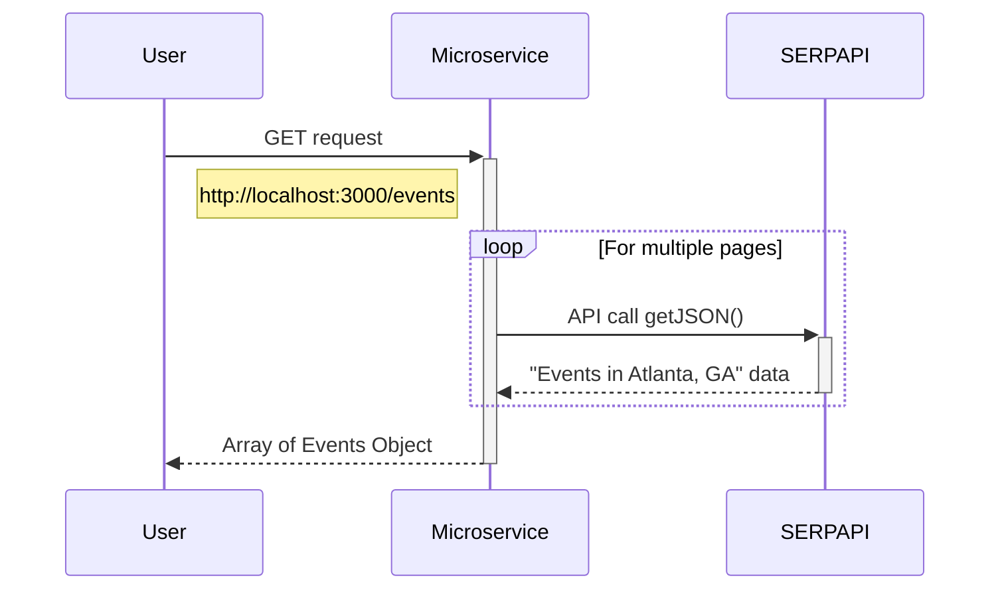

# 361_microservice

### Set up:
1. Run ` npm install `
2. Create an account at [Google Events API](https://serpapi.com/google-events-api)
3. Create  `.env` file and paste this ` API_KEY = "" `
4. Copy your API KEY and paste it in your ` .env ` file
5. Run ` npm start `

### How to REQUEST data from the microservice:
1. Send an HTTP get request using the URL `http://localhost:3000/events`

### How to RECEIVE data from the microservice:
1. After the above get request, the server will respond with a HTTP response
2. The data that is returned are JSON structured of events in Atlanta, GA happening today.
3. You can view [example](https://serpapi.com/google-events-api) here

